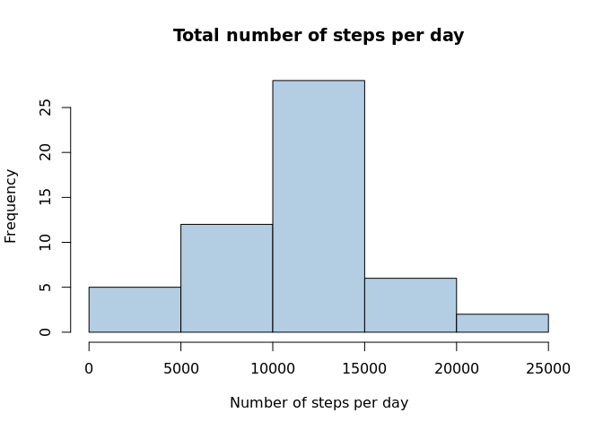
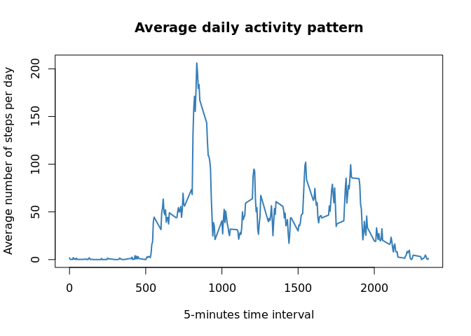
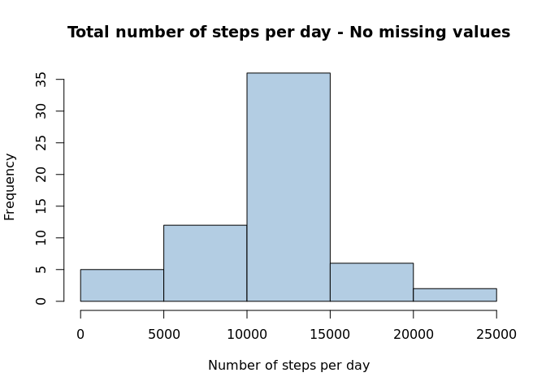
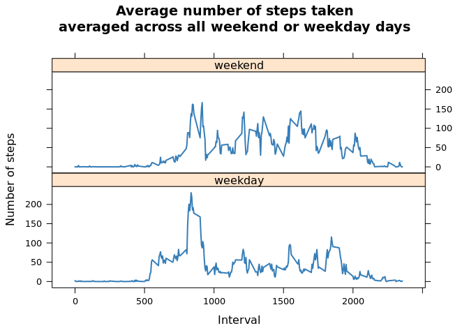

# Reproducible Research: Peer Assessment 1

## Preparation of environment

```r
library(dplyr)
library(lattice)
library(lubridate)
library(RColorBrewer)
pal1 <- brewer.pal(9, "Pastel1")
pal2 <- brewer.pal(9, "Set1")
```

## Loading and preprocessing the data


```r
options(scipen = 1, digits = 2)
data <- read.csv("activity.csv")
data1 <- data %>%
	group_by(date)	%>%
	summarise(totalSteps = sum(steps))
hist(data1$totalSteps, main = "Total number of steps per day", 
	 xlab = "Number of steps per day", col = pal1[2])
```

 

```r
dev.copy(png, "figure/plot1.png"); dev.off()
```


## What is mean total number of steps taken per day?


```r
meanSteps   <- mean(data1$totalSteps, na.rm = TRUE)
medianSteps <- median(data1$totalSteps, na.rm = TRUE)
```

The mean total number of steps taken per day is **10766.19**.

The median total number of steps taken per day is **10765**.

## What is the average daily activity pattern?


```r
data2 <- data %>%
	group_by(interval) %>%
	summarise(meanSteps = mean(steps, na.rm = TRUE))
with(data2, plot(interval, meanSteps, main = "Average daily activity pattern",
	xlab = "5-minutes time interval", ylab = "Average number of steps per day",
	col = pal2[2], type = "l", lwd = 2))
```

 

```r
maxInterval <- data2[which.max(data2$meanSteps),1][[1]]
maxMeanSteps <- data2[which.max(data2$meanSteps),2][[1]]
```

```r
dev.copy(png, "figure/plot2.png"); dev.off()
```

The **835** 5-minute interval contains the maximum number of steps
(**206.17**), on average across all the days.

## Imputing missing values


```r
missingValues <- sum(!complete.cases(data))
# Extrapolate missing values from mean intervals
extrapolatedInterval <- lapply(data$interval, function(x) {
	data2[which(data2$interval == x),2][[1]] }) %>%
	matrix(ncol = 1, dimnames = list(NULL, "extrapolatedInterval")) %>%
	data.frame(stringsAsFactors = FALSE) 
# Original data with missing values replaced by mean intervals
data <- data %>%
	bind_cols(extrapolatedInterval) %>%
	mutate(steps = ifelse(
		is.na(steps), as.numeric(extrapolatedInterval), steps))	
data1 <- data %>%
	group_by(date) %>%
	summarise(totalSteps = sum(steps))
hist(data1$totalSteps, 
	 main = "Total number of steps per day - No missing values", 
	 xlab = "Number of steps per day", col = pal1[2])
```

 

```r
meanSteps   <- mean(data1$totalSteps, na.rm = TRUE)
medianSteps <- median(data1$totalSteps, na.rm = TRUE)
```

```r
dev.copy(png, "figure/plot3.png"); dev.off()
```

There are **2304** missing values in the data set. The strategy for
imputing missing data was to replace them by the mean for the corresponding
intervals.

The mean total number of steps taken per day is **10766.19**.

The median total number of steps taken per day is **10766.19**.

## Are there differences in activity patterns between weekdays and weekends?


```r
data <- data %>%
	mutate(day = ifelse(
		wday(ymd(date)) == 7 | wday(ymd(date)) == 1, "weekend", "weekday")) %>%
	mutate(day = factor(day))
data1 <- data %>%
	group_by(day, interval) %>%
	summarise(averageSteps = mean(steps))
xyplot(averageSteps ~ interval | day, data1, type = "l", layout = c(1,2),
	   xlab = "Interval", ylab = "Number of steps", 
	   col = pal2[[2]], lwd = 2, 
	   main = "Average number of steps taken\naveraged across all weekend or weekday days")
```

 

```r
dev.copy(png, "figure/plot4.png"); dev.off()
```
